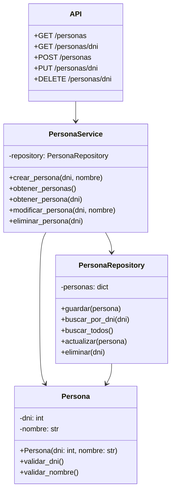

# CRUD de Personas

API REST desarrollada con **Python y Flask** para administrar personas mediante operaciones CRUD.

El proyecto está organizado utilizando una arquitectura por capas, separando las responsabilidades entre **Model, Repository, Service y API**.

---

## Tecnologías utilizadas

- Python
- Flask
- API REST
- Mermaid
- Git / GitHub

---

## Estructura del proyecto

```text
persona_crud/
│
├── models/
│   ├── __init__.py
│   └── persona.py
│
├── repositories/
│   ├── __init__.py
│   └── persona_repository.py
│
├── services/
│   ├── __init__.py
│   └── persona_service.py
│
├── api.py
└── README.md
```

### Responsabilidad de cada carpeta

#### `models/`

Contiene las clases principales del sistema.

El modelo `Persona` se encarga de representar una persona y de validar sus propias reglas de negocio.

#### `repositories/`

Se encarga de la persistencia de los datos.

El repositorio define las operaciones necesarias para:

- Guardar personas.
- Buscar una persona por DNI.
- Obtener todas las personas.
- Actualizar una persona.
- Eliminar una persona.

El modelo **no accede directamente al repositorio**.

#### `services/`

Contiene la lógica de negocio que necesita coordinar el modelo y el repositorio.

El Service se encarga de operaciones como:

- Crear una persona.
- Obtener una persona.
- Obtener todas las personas.
- Modificar una persona.
- Eliminar una persona.

#### `api.py`

Contiene los endpoints de Flask y es el punto de entrada de la API.

La API recibe las peticiones HTTP, utiliza el Service correspondiente y devuelve la respuesta al cliente.

---

# Diagrama de clases



---

# Reglas de negocio

La clase `Persona` debe garantizar que el objeto siempre sea válido durante todo su ciclo de vida.

## DNI

- Debe ser un número entero.
- Debe ser mayor a `0`.
- No puede repetirse.
- El DNI identifica de manera única a una persona.
- El DNI no se modifica mediante el endpoint `PUT`.

## Nombre

- No puede estar vacío.
- No puede tener más de **30 caracteres**.
- Solo puede contener letras.
- La primera letra debe ser mayúscula.
- Las letras restantes deben estar en minúscula.
- No se permiten números.
- No se permiten espacios.

### Ejemplos

Nombre válido:

```text
Lucas
Martin
Pedro
```

Nombres inválidos:

```text
lucas
LUCAS
Lucas123
Lucas Perez
Lucas123Perez
```

---

# Arquitectura

El proyecto utiliza una arquitectura por capas:

```text
Cliente
   │
   ▼
┌─────────────┐
│     API     │
└──────┬──────┘
       │
       ▼
┌─────────────┐
│   Service   │
└──────┬──────┘
       │
       ├──────────────► Model
       │
       ▼
┌─────────────┐
│ Repository  │
└──────┬──────┘
       │
       ▼
  Persistencia
```

Cada capa tiene una responsabilidad específica.

### API

Se ocupa de la comunicación HTTP.

No contiene las reglas principales del negocio ni maneja directamente la persistencia.

### Service

Coordina las operaciones del sistema.

Puede utilizar el modelo y el repositorio para llevar adelante una operación completa.

### Model

Representa los objetos del dominio.

Es responsable de sus propias reglas de negocio y de mantener su estado consistente.

### Repository

Se ocupa exclusivamente de la persistencia.

La implementación actual utiliza un diccionario en memoria como mecanismo de almacenamiento.

---

# CRUD

La API permite realizar las cuatro operaciones principales:

- **Create** → Crear una persona.
- **Read** → Consultar personas.
- **Update** → Modificar una persona.
- **Delete** → Eliminar una persona.

---

# Endpoints

## Obtener todas las personas

```http
GET /personas
```

Ejemplo de respuesta:

```json
[
    {
        "dni": 12345678,
        "nombre": "Lucas"
    },
    {
        "dni": 87654321,
        "nombre": "Martin"
    }
]
```

---

## Obtener una persona

```http
GET /personas/<dni>
```

Ejemplo:

```http
GET /personas/12345678
```

Respuesta:

```json
{
    "dni": 12345678,
    "nombre": "Lucas"
}
```

Si la persona no existe:

```json
{
    "error": "La persona no existe"
}
```

---

## Crear una persona

```http
POST /personas
```

Body:

```json
{
    "dni": 12345678,
    "nombre": "Lucas"
}
```

Respuesta:

```json
{
    "dni": 12345678,
    "nombre": "Lucas"
}
```

Código HTTP:

```text
201 Created
```

Si el DNI ya existe:

```json
{
    "error": "Ya existe una persona con ese DNI"
}
```

---

## Modificar una persona

```http
PUT /personas/<dni>
```

Ejemplo:

```http
PUT /personas/12345678
```

Body:

```json
{
    "nombre": "Martin"
}
```

Respuesta:

```json
{
    "dni": 12345678,
    "nombre": "Martin"
}
```

El DNI no se modifica.

---

## Eliminar una persona

```http
DELETE /personas/<dni>
```

Ejemplo:

```http
DELETE /personas/12345678
```

Respuesta:

```json
{
    "mensaje": "Persona eliminada correctamente"
}
```

---

# Flujo de una operación

Por ejemplo, al crear una persona:

```text
POST /personas
       │
       ▼
      API
       │
       ▼
    Service
       │
       ▼
    Persona
       │
       ▼
  Repository
       │
       ▼
 Persistencia
```

El flujo permite mantener separadas las responsabilidades.

La API no crea directamente los datos en el repositorio y el modelo no conoce la existencia del repositorio.

---

# Persistencia

Actualmente se utiliza un diccionario de Python como mecanismo de persistencia:

```python
self._personas = {}
```

El DNI se utiliza como clave:

```text
DNI
